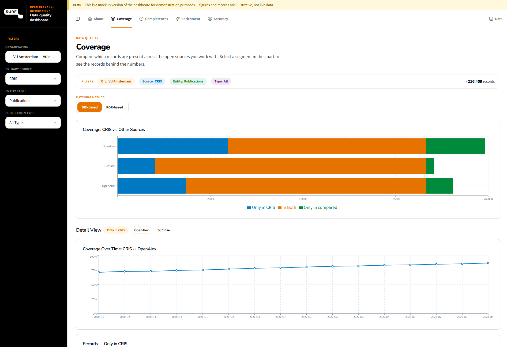

# ORI Data Quality Dashboard

A dashboard for Dutch Research Performing Organisations (RPOs) to monitor the quality of **Open Research Information (ORI)** across multiple sources — OpenAlex, Crossref, OpenAIRE and local CRIS systems. It surfaces **Completeness**, **Coverage**, **Accuracy** and **Enrichment** of research metadata, in line with the [Barcelona Declaration on Open Research Information](https://barcelona-declaration.org/).

*Live demo: [ori-dashboard.lovable.app](https://ori-dashboard.lovable.app/)*

## Background

This dashboard is a result of the **PID to Portal** project — see [From PID to Portal: strengthening the Open Research Information](https://communities.surf.nl/en/open-research-information/article/from-pid-to-portal-strengthening-the-open-research-information).

PID to Portal is part of the SURF **Open Research Information Program 2025–2030** ([program announcement](https://communities.surf.nl/open-research-information/artikel/open-research-information-program-2025-2030-published)), whose mission is:

> "All information about Dutch publicly funded research and its results are openly available and reusable."

## About the demo

The dashboard is a **mockup for demonstration purposes** — figures and records are illustrative, not live data. It is intended to show how metadata specialists at Dutch RPOs could explore quality metrics across organisations, CERIF entities, sources and publication types.

## Tech stack

Built with React, Vite, TypeScript, Tailwind CSS and Recharts.
